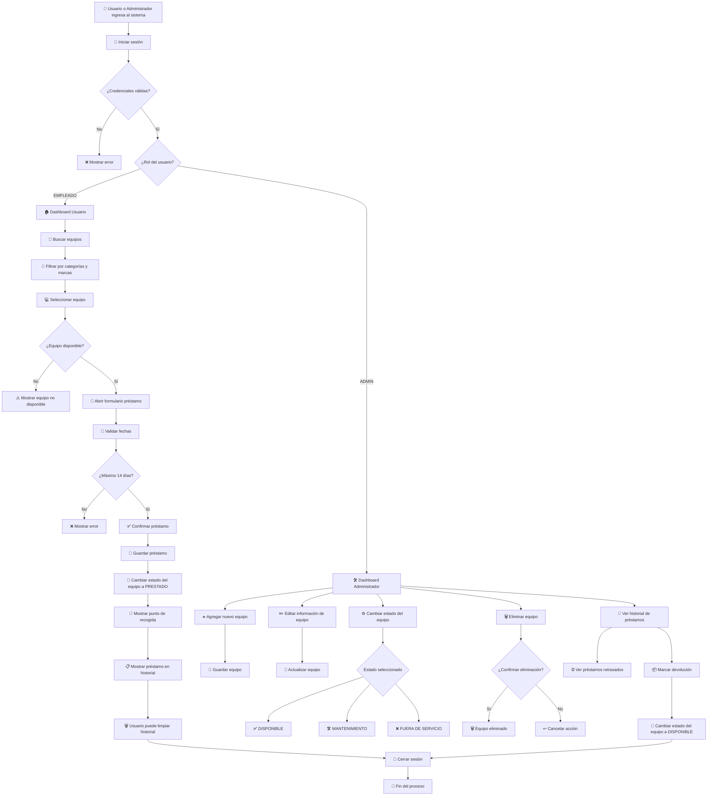

# 💻 Sistema de Préstamos de Equipos TI

Proyecto desarrollado en Angular para la gestión de préstamos de equipos tecnológicos dentro de una empresa.

---

# 📌 Descripción del Proyecto

Este sistema permite administrar el préstamo de equipos TI como:

- 💻 Laptops
- 🖥 Monitores
- 📱 Tablets
- 🖱 Mouse
- ⌨️ Teclados

Los empleados pueden:
- iniciar sesión
- solicitar préstamos
- consultar sus préstamos activos
- visualizar estados de equipos

Mientras que el administrador puede:
- agregar equipos
- editar información
- cambiar estados
- eliminar productos
- gestionar devoluciones
- revisar historial de préstamos

---

# 🚀 Tecnologías Utilizadas

- ⚡ Angular
- 🎨 HTML5
- 🎨 CSS3
- 🟨 TypeScript
- 💾 LocalStorage

---

# 🛠 Instalación del Proyecto

## 1. Clonar repositorio

```bash
git clone https://github.com/JCAplata/prestamos_wwb.git
```

---

## 2. Entrar al proyecto

```bash
cd prestamos_wwb
```

---

## 3. Instalar dependencias

```bash
npm install
```

---

## 4. Ejecutar proyecto

```bash
ng serve
```

Luego abrir:

```txt
http://localhost:4200
```

---

# 📚 Explicación Básica de Angular

Angular es un framework frontend desarrollado por Google para construir aplicaciones web dinámicas y escalables.

En este proyecto se utilizó Angular porque permite:

- organizar el proyecto por componentes
- reutilizar código
- manejar rutas
- manejar formularios
- separar lógica y vistas
- escalar fácilmente el sistema

---

# ⚙️ Comandos Básicos de Angular

## Crear proyecto Angular

```bash
ng new nombre_del_proyecto
```

---

## Levantar servidor

```bash
ng serve
```

---

## Crear componente

```bash
ng generate component nombre-componente
```

o abreviado:

```bash
ng g c nombre-componente
```

---

## Crear servicio

```bash
ng g service services/nombre-servicio
```

---

## Crear guard

```bash
ng g guard guards/nombre-guard
```

---

# 👥 Roles del Sistema

## 👨‍💼 Administrador

Puede:
- agregar equipos
- editar equipos
- eliminar equipos
- cambiar estados
- visualizar historial
- marcar devoluciones

---

## 👨‍💻 Empleado

Puede:
- iniciar sesión
- registrarse
- buscar equipos
- filtrar por categorías y marcas
- solicitar préstamos
- ver historial de préstamos

---

# 🧩 Funcionalidades Implementadas

## 🔐 Autenticación

- Login
- Registro
- Persistencia de sesión con LocalStorage

---

## 📦 Gestión de Equipos

- Agregar equipos
- Editar información
- Eliminar productos
- Cambiar estados:
  - Disponible
  - Mantenimiento
  - Fuera de servicio

---

## 📋 Sistema de Préstamos

- Solicitud de préstamo
- Validación máxima de 14 días
- Validación de fechas
- Confirmación de préstamo
- Historial de préstamos
- Marcar devolución

---

## 🎨 Interfaz

- Diseño responsive
- Navbar dinámica
- Tarjetas de equipos
- Formularios modernos
- Modal de préstamo

---

# 🔄 Diagrama General del Sistema

El siguiente diagrama representa el flujo completo del sistema tanto para empleados como administradores, mostrando el proceso de autenticación, gestión de préstamos, validaciones y administración de equipos.

---



---

## 📌 Explicación del Diagrama

El flujo inicia cuando un usuario o administrador accede al sistema mediante autenticación.

Dependiendo del rol:
- 👨‍💻 el empleado puede buscar equipos, filtrarlos y solicitar préstamos.
- 👨‍💼 el administrador puede gestionar el inventario, controlar estados y administrar devoluciones.

El sistema valida:
- disponibilidad del equipo
- límite máximo de préstamo
- estados de inventario
- confirmaciones antes de acciones críticas

Finalmente, los préstamos quedan registrados en historial y los equipos pueden volver a estar disponibles una vez se realiza la devolución.

---

# 🧠 Fase de Análisis

## 📌 Entidades Principales

### 👤 Usuario

Representa las personas que utilizan el sistema.

#### Atributos:
- id
- nombre
- correo
- cargo
- password
- rol

---

### 💻 Equipo

Representa los equipos tecnológicos disponibles para préstamo.

#### Atributos:
- id
- nombre
- categoría
- marca
- imagen
- estado

---

### 📄 Préstamo

Representa la solicitud de préstamo realizada por un usuario.

#### Atributos:
- id
- nombrePersona
- cargo
- fechaInicio
- fechaFin
- equipo
- estado

---

# 📏 Reglas de Negocio

- Un equipo solo puede prestarse si está en estado "DISPONIBLE".
- El préstamo no puede superar 14 días.
- No se permiten fechas pasadas.
- El administrador puede cambiar el estado de un equipo.
- Solo el administrador puede eliminar equipos.
- Cuando un préstamo se devuelve, el equipo vuelve a estado "DISPONIBLE".
- Los usuarios deben tener correo único para registrarse.

---

# 🌐 Fase de Pensamiento Sistémico

## ⚠️ Caso 1: Dos usuarios solicitan el mismo equipo al mismo tiempo

### Problema:
Dos empleados podrían intentar pedir el mismo equipo simultáneamente.

### Solución:
El sistema debe validar nuevamente el estado del equipo antes de confirmar el préstamo. Si el equipo ya fue tomado, debe mostrar un mensaje indicando que el equipo ya no está disponible.

---

## ⚠️ Caso 2: Fallo de almacenamiento o pérdida de LocalStorage

### Problema:
El navegador podría borrar la información almacenada localmente.

### Solución:
El sistema debería contar con un backend y base de datos real para garantizar persistencia y recuperación de datos.

---

## ⚠️ Caso 3: Usuario intenta modificar información manualmente desde el navegador

### Problema:
Un usuario podría alterar datos desde herramientas del navegador (F12).

### Solución:
En un entorno real, las validaciones y autenticación deben realizarse también en backend para evitar manipulaciones.

---

## ⚠️ Caso 4: Equipo en mantenimiento intenta ser prestado

### Problema:
Un usuario podría intentar solicitar un equipo fuera de servicio.

### Solución:
El sistema bloquea automáticamente solicitudes sobre equipos que no estén disponibles.

---

# 📂 Estructura del Proyecto

```txt
src/app
│
├── core
├── data
├── pages
├── services
├── guards
├── layouts
├── shared
└── models
```

---

# 📸 Características Visuales

✅ Responsive Design  
✅ Dashboard Administrador  
✅ Dashboard Usuario  
✅ Sistema CRUD  
✅ Modal interactivo  
✅ Filtros dinámicos  
✅ Diseño moderno  

---

# 👨‍💻 Autor

Proyecto desarrollado por:

## Camilo Amezquita

---

# 🎯 Estado del Proyecto

✅ Funcional  
✅ Responsive  
✅ CRUD Completo  
✅ Gestión de préstamos  
✅ Gestión de usuarios  
✅ Gestión administrativa  

---